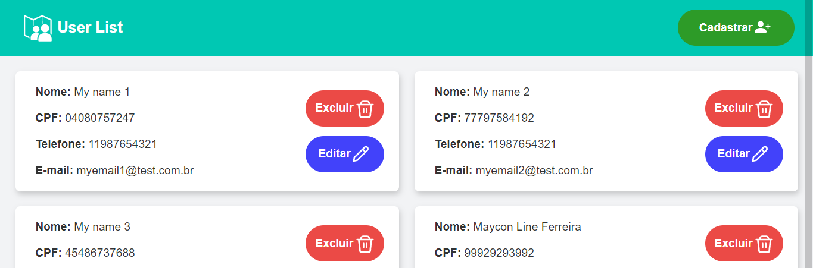

<p align="center">
   
</p>

# Fake User List

#### 📌 About

- Fake User List - Using Web Components with Typescript

#### 🛒 Deploy on Vercel

- [Production](https://fake-user-list.vercel.app/)

#### 🧑‍💻 Technologies

- [Web Components](https://developer.mozilla.org/pt-BR/docs/Web/Web_Components)
- [Typescript](https://www.typescriptlang.org/docs/)
- [Mock-User-API](https://private-847f5-ivangenesis.apiary-mock.com/users)
- [Jest](https://jestjs.io/docs/en/getting-started)
<!-- - [Cypress](https://docs.cypress.io/guides/overview/why-cypress) -->

#### ⚙️ Getting Started

First, [install Live Server on VSCode](https://marketplace.visualstudio.com/items?itemName=ritwickdey.LiveServer)

For run the development server:

```bash
npm run dev

open live server
```

For build, run:

```bash
npm run build

files generate on ./dist

open live server
```

Open [http://localhost:5500/](http://localhost:5500/) with your browser to see the result.

#### 📋 Tests

For run jest tests:

```bash
npm run test
```

<!-- For run cypress tests:

```bash
npm run cypress
``` -->

#### 📱 Preview Responsive

<p align="center">
<video src='https://user-images.githubusercontent.com/38052474/152664560-d8f47d64-7443-4949-b23c-462e3f86d0a7.mp4' width=180/> 
</p>


#### 💻 Preview PC

<p align="center">
<video src='https://user-images.githubusercontent.com/38052474/152664563-41624724-e3f2-4d72-8178-334dc2236d42.mp4' width=180/>
</p>
